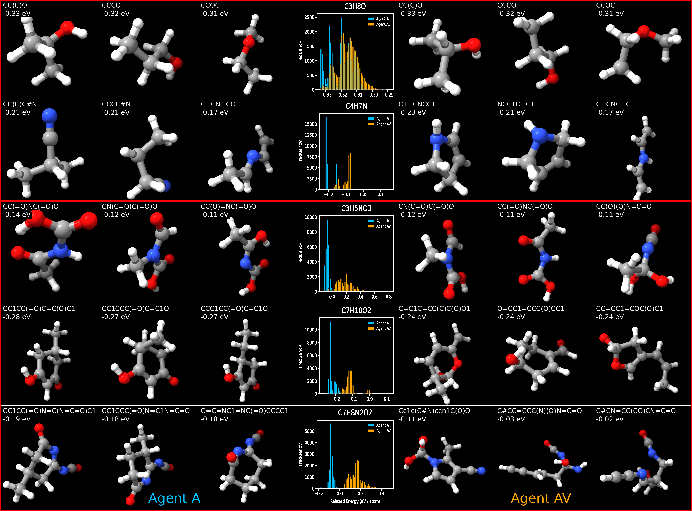

# Isomer Discovery with Reinforcement Learning

This repository contains the training and analysis code used in the study:

**Rediscovering Chemical Space from First Principles with Reinforcement Learning**  
*Bjarke Hastrup, François Cornet, Tejs Vegge, and Arghya Bhowmik*  
Under review at *Nature Communications*.  
Preprint (Version 1) available on [Research Square](https://doi.org/10.21203/rs.3.rs-6900238/v1).





## Installation Guide

### 1. Install Conda (if not already installed)
Make sure you have [Miniconda](https://docs.conda.io/en/latest/miniconda.html) or [Anaconda](https://www.anaconda.com/) installed on your system.


### 2. Clone the Repository
```bash
git clone https://github.com/yourusername/isomer-discovery-rl.git
cd isomer-discovery-rl
```


### 3. Install Mamba (if not already installed)
```bash
conda install -n base -c conda-forge mamba
```

### 4. Create the Environment using Mamba
Run the following command to create the environment from `env.yaml`:
```bash
mamba env create -f env.yaml
```

### 4. Activate the Environment
Once the installation is complete, activate the environment:
```bash
eval "$(mamba shell hook --shell bash)"
mamaba activate rl-env
```

### 5. Verify Installation
Check that the required packages are installed:

```bash
python -c 'import torch, ase, rdkit, streamlit, pandas; print("✅ All core packages are working!")'
```

### Set Up PYTHONPATH (One-Time)

To ensure Python can locate the `src/` package, set the `PYTHONPATH` automatically when activating the environment:

Run the following **from the root of the project directory** (where `src/` is located):

```bash
# Set PYTHONPATH when the Conda environment is activated
mkdir -p $CONDA_PREFIX/etc/conda/activate.d
echo "export PYTHONPATH=\$(pwd)" > $CONDA_PREFIX/etc/conda/activate.d/env_vars.sh

# Optionally unset it on deactivate
mkdir -p $CONDA_PREFIX/etc/conda/deactivate.d
echo "unset PYTHONPATH" > $CONDA_PREFIX/etc/conda/deactivate.d/env_vars.sh


## Dataset preparation
For QM7 training, run the following commands (takes 1-2 minutes)
``` bash
python scripts/prep/preprocess_data.py
python scripts/prep/split_train_test.py
```
This saves a dataset of QM7 structures into the *data/* folder (along with XTB energies, SMILES representations and additional meta-data).
QM9 is available also - see preprocess_data.py for arguments.


## Launch RL training
Training scripts are available in the *scripts/train/* folder. Specifically, a training job can be launched as
``` bash
python scripts/train/experiments/nat-com-version/a.py
```
This files launches a training of "Agent A" from the paper. The script contains further instructions for how to setup the other agent trainings.


## Analyse trainings (isomer discovery campaings):
Analysis scripts are available in the *scripts/analyse/* folder, which is further subdivided into.


# An interactive webapp for molecular generation
