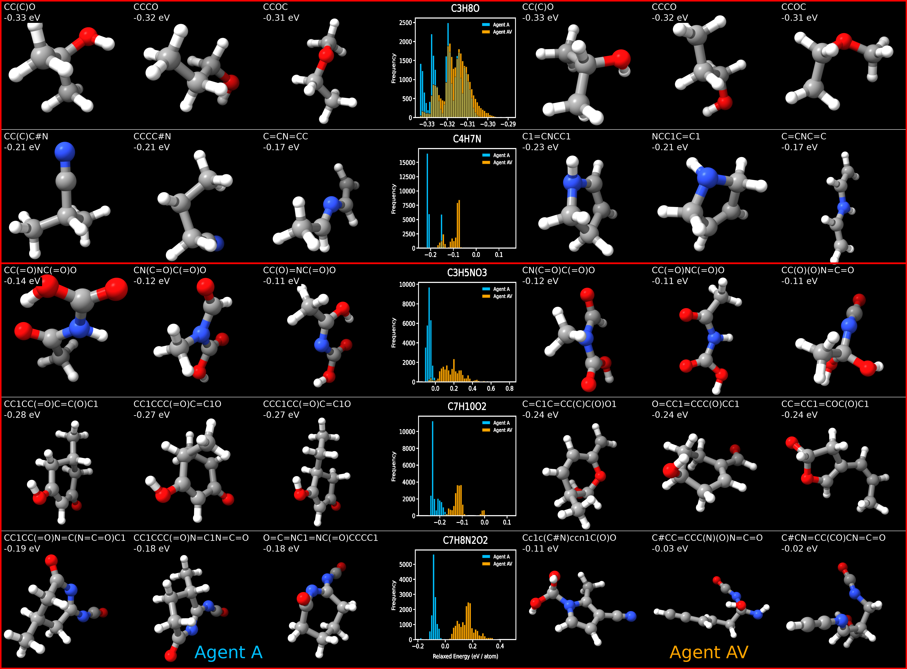
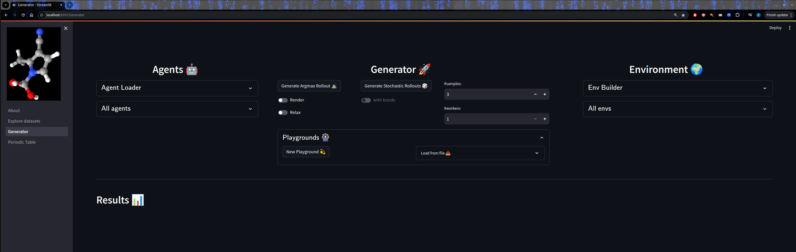

# Rediscovering Chemical Space from First Principles with Reinforcement Learning

This repository contains the training and analysis code used in the study:

**Rediscovering Chemical Space from First Principles with Reinforcement Learning**  
*Bjarke Hastrup, François Cornet, Tejs Vegge, and Arghya Bhowmik*  
Under review at *Nature Communications*.  
Preprint (Version 1) available on [Research Square](https://doi.org/10.21203/rs.3.rs-6900238/v1).





## Installation Guide

### 1. Install Conda (if not already installed)
Make sure you have [Miniconda](https://docs.conda.io/en/latest/miniconda.html) or [Anaconda](https://www.anaconda.com/) installed on your system.


### 2. Clone the Repository
```bash
git clone https://github.com/bhastrup/isomer-discovery-rl.git
cd isomer-discovery-rl
```


### 3. Install Mamba (if not already installed)
```bash
conda install -n base -c conda-forge mamba
```

### 4. Create the Environment using Mamba
Run the following command to create the environment from `env.yaml`:
```bash
mamba env create -f env.yaml
```

### 5. Activate the Environment
Once the installation is complete, activate the environment:
```bash
eval "$(mamba shell hook --shell bash)"
mamba activate rl-env
```

### 6. Verify Installation
Check that the required packages are installed:

```bash
python -c 'import torch, ase, rdkit, streamlit, pandas; print("✅ All core packages are working!")'
```

### 7. Set Up PYTHONPATH (One-Time)

To ensure Python can locate the `src/` package, set the `PYTHONPATH` automatically when activating the environment: Run the following **from the root of the project directory** (where `src/` is located):

```bash
# Set PYTHONPATH when the Conda environment is activated
mkdir -p $CONDA_PREFIX/etc/conda/activate.d
echo "export PYTHONPATH=\$(pwd)" > $CONDA_PREFIX/etc/conda/activate.d/env_vars.sh

# Unset it on deactivate
mkdir -p $CONDA_PREFIX/etc/conda/deactivate.d
echo "unset PYTHONPATH" > $CONDA_PREFIX/etc/conda/deactivate.d/env_vars.sh
```
and reactivate the *rl-env*.


## Dataset preparation
For QM7 training, run the following commands (takes 1-2 minutes):
``` bash
python scripts/prep/preprocess_data.py
python scripts/prep/split_train_test.py
```
This saves a dataset of QM7 structures into the *data/* folder (along with XTB energies, SMILES representations and additional meta-data).
QM9 is available also - see preprocess_data.py for arguments.


## RL training
### Launch training jobs
Training scripts are available in the *scripts/train/* folder. Specifically, a training job can be launched as
``` bash
python scripts/train/experiments/nat-com-version/a.py
```
This launches a training of "Agent A" from the paper. The script also contains instructions for how to set up the other agent trainings. All results are saved to disk under `runs/` regardless of the logging settings below.

### Weights & Biases (optional)
Training metrics can optionally be tracked with [Weights & Biases](https://wandb.ai/). To disable it, set `save_to_wandb=False` in the training config — all metrics will then be saved to disk only.

To enable W&B, log in and set your entity:
```bash
wandb login
export WANDB_ENTITY=your_wandb_username
```


## Analyse trainings (isomer discovery campaings):
Analysis scripts are available in the *scripts/analyse/* folder, which is further subdivided into
* exp1: Containing single bag evaluation (Q1 in the paper).
* exp2: Multibag evaluations on hold-out formulas (Q2 in the paper).
* exp3: Cumulative discovery analysis where the entire training is seen as a discovery campaign (Q3 in the paper).


# Web app
To quickly interact with the trained agents, we provide a Streamlit-based web app that can be launched using
``` bash
streamlit run app_store/About.py
```


In the sidebar on the left-hand side, navigate to the **Generator** page. This page is split into three columns, **Agents 🤖** (model checkpoints), **Environments 🌍** (chemical compositions) and **PlayGrounds 🎡 / Generator 🚀** which is the inference modules that take an (agent, environment)-pair as input and sample new molecules according to the agent policy.
### How to use:
* In the center column, click the **New Playground 💫** button. This creates a new playground named *Playground 0* that opens in *edit* mode. Before we can **Deploy** this playground and use the **Generator 🚀** functionality, we must provide it with both agent and env objects:
    * **Agents 🤖**: Loaded agents are displayed in the **All agents** expander (left column). We have pre-loaded 5 agent checkpoints from the paper, namely agents *A, AV, F, FV and AFV*.  These are named according to the abbreviations of the three core reward terms they are trained on. These are *A: Atomization energy, F: Formation energy, V: Validity*. See paper for explanations. For the desired agent checkpoint, click **To playgrounds**. This adds it to any playground currently in *edit* mode. For direct agent comparison, you can add multiple agents into the same playground. 
    * **Environments 🌍**: Loaded envs are displayed in the **All envs** expander (right column). We have pre-loaded 5 chemical formulas from the paper, namely C3H8O, C4H7N, C3H5NO3, C7H10O2, and C7H8N2O2.
* **Generate results 🚀**: Start small, until you are familiar with the expected output.


#### i) Load other agent checkpoints
To load other agent checkpoints, use the GUI in the **"Agent Loader** expander. Use the file system explorer to find the checkpoint, but rather than double-clicking, just copy the path and paste into the line below. Select *cuda* (if available) and provide a name for the new agent before clicking **Load agent**. Note that the *model_objects/* folder also contains checkpoints for seed 1 and 2.


---

## Known Issues and Planned Improvements

This section tracks outstanding issues that should be addressed before or after final publication. Contributions welcome.

### High priority

- **Confusing `config_ft` structure.** The online RL (PPO) parameters live inside `config["config_ft"]` — a name inherited from an earlier pretraining→finetuning workflow that was not used in the final paper. In the paper, all agents are trained from scratch (*tabula rasa*). The nesting and the name are confusing; we plan to flatten the config structure in a future refactor.

- **No test suite.** The repository currently has no automated tests. We plan to add at minimum: smoke tests for environment step and reward calculation, and a forward-pass test for the PaiNN agent. This is important for verifying that the codebase runs correctly on a new machine without running a full training job.

- **App clean up.** Make sure app is also tight and has documentation in the readme.

### Code quality

- **Mixed logging styles.** Core modules in `src/` use a mix of `print()` and the `logging` module. We plan to standardise on `logging` throughout.


### Missing analysis scripts

- **Learning curve plotting.** The script for reproducing the training learning curves (validity, atomization energy, etc. vs. training steps) is not yet in the repository. It requires stitching together multiple W&B runs across seeds and restarts. The plan is to export the smoothed curve data as CSV files and provide a clean plotting script that reads from those — so the figures can be reproduced without a W&B account.

### Planned (post-submission)

- **Integrate the advanced `Trainer` class.** A more modular `Trainer` architecture exists in a development branch and is better suited for extension. We plan to migrate to it once all tests are in place, to avoid introducing subtle changes to training dynamics.

- **CI/CD pipeline.** Add GitHub Actions to run the test suite and linter on every push.

